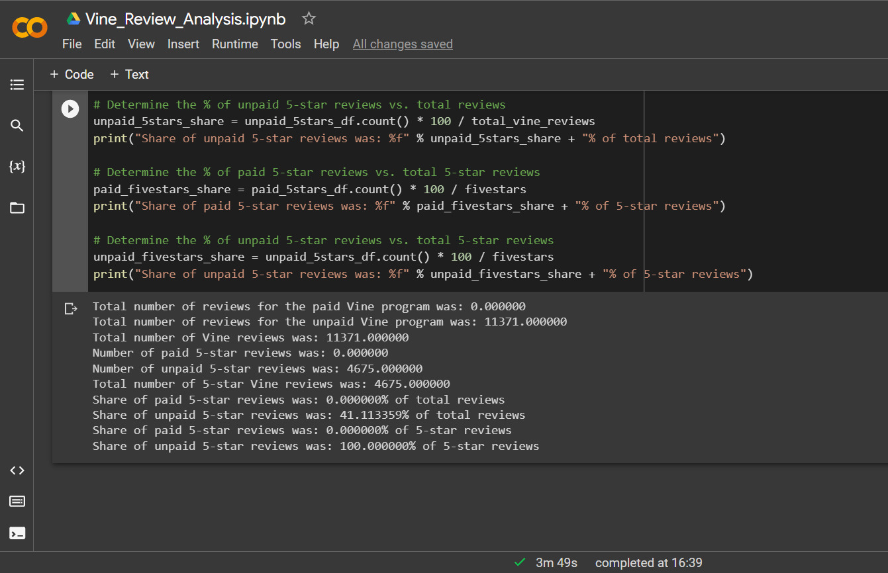

# Amazon_Vine_Analysis

## Overview
The Amazon Vine program is a service that allows manufacturers and publishers to receive reviews for their products. Companies like SellBy pay a small fee to Amazon and provide products to Amazon Vine members, who are then required to publish a review. We’ve been tasked with analyzing Amazon reviews written by members of the paid Amazon Vine program to determine if there is any bias toward favorable reviews from Vine members in the dataset.

## Results

### How many Vine reviews and non-Vine reviews were there?
After filtering the data to keep only reviews with 20 or more votes and helpful votes where at at least 50% of the total are positive, the dataset came down to 11,371 total Vine reviews and out of those, there were no paid Vine reviews.
 

### How many Vine reviews were 5 stars? How many non-Vine reviews were 5 stars?
There were 4,675 5-star reviews in total, of which none were paid Vine reviews (since there are no paid Vine reviews at all) and all 4,675 were unpaid Vine reviews.
 

### What percentage of Vine reviews were 5 stars? What percentage of non-Vine reviews were 5 stars?

## Summary

